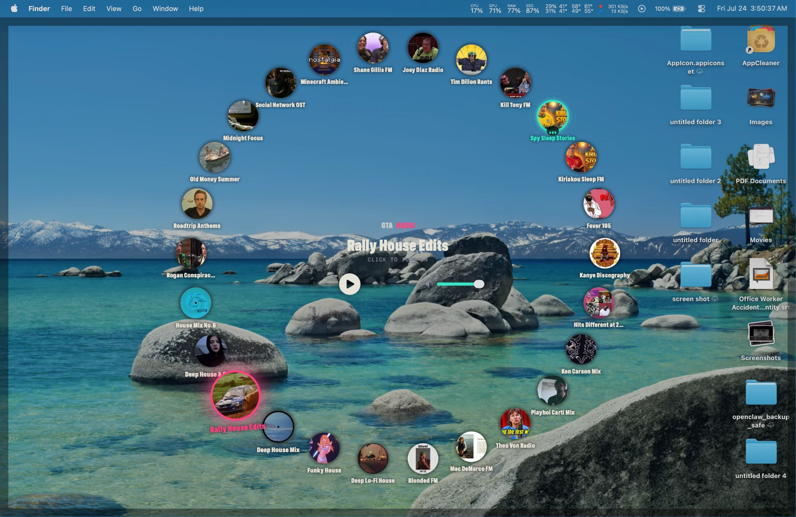
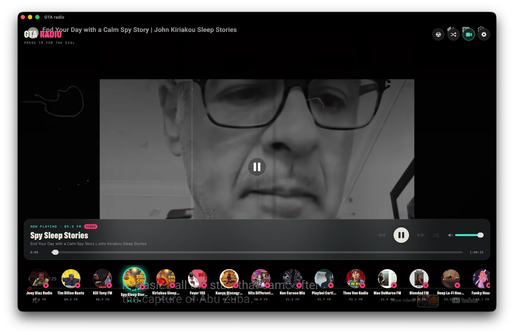
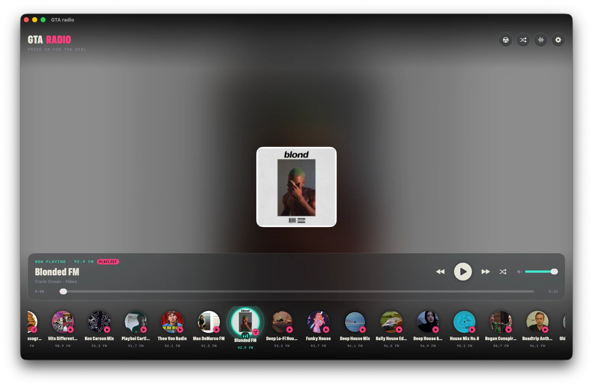

# Wasted FM (GTA Radio)

A sandboxed macOS app that turns YouTube into a GTA-style car radio. 26 stations
on a filmstrip HUD, a full-bleed video/audio player, and a global-hotkey radial
dial so you can change the station without even looking at the window — no API
key, no downloads, no account.

<p align="center">
  <br>
  <em>Press ⌥R from anywhere — the dial floats over your desktop, any app, any window.</em>
</p>

## Demo

[](https://www.youtube.com/watch?v=gHCbKFGqf-w)

## Download

**[⬇️ Download WastedFM.dmg](https://github.com/UVKUSH/GTA-radio/releases/latest/download/WastedFM.dmg)**
— macOS (Apple Silicon), no install of Xcode or dependencies required.

### Install

1. Download the `.dmg` above and open it.
2. Drag **GTA radio** into the **Applications** folder shown in the window.
3. **First launch only:** this build isn't notarized by Apple (that requires a
   paid developer certificate the app doesn't have yet), so macOS Gatekeeper
   will say the app "cannot be opened because it is from an unidentified
   developer." To open it anyway:
   - **Right-click (or Control-click) the app → Open → Open**, or
   - If that option isn't offered, go to **System Settings → Privacy &
     Security**, scroll down, and click **Open Anyway** next to the GTA radio
     warning, then confirm.
   - You only need to do this once — after the first launch it opens normally.
4. Grant it network access if prompted (it needs this to load YouTube).

That's it — no accounts, no API keys, nothing else to configure.

## Screenshots

<p align="center">
  <br>
  <em>Video mode — any YouTube video or podcast becomes a station.</em>
</p>

<p align="center">
  <br>
  <em>Audio mode — ambient blurred cover art behind GTA-style FM presets.</em>
</p>

## Features

- **26-slot filmstrip HUD** — any slot can also be a folder holding its own 26
  stations, recursively.
- **Global-hotkey radial dial (⌥R)** — pulls up over the desktop or any app to
  switch stations without switching focus.
- **Video or audio-only playback** — toggle per station; audio mode shows a
  blurred, ambient version of the video's cover art.
- **Wheels** — save a full 26-slot layout, hot-swap between them with ⌘1–9,
  and share a wheel with a friend as a JSON file.
- **No API key, no media extraction** — playback goes through the official
  YouTube IFrame player; metadata comes from public oEmbed/playlist data.
- **Shuffle**, launch-at-login, and a replayable first-run tour (Settings →
  replay onboarding).

## Building from source

Requires Xcode and macOS 26 (Tahoe) or later on Apple Silicon.

```bash
git clone https://github.com/UVKUSH/GTA-radio.git
cd GTA-radio
open "GTA radio.xcodeproj"
```

Build and run the **GTA radio** scheme. See [docs/RELEASING.md](docs/RELEASING.md)
for how the notarized release `.dmg` is produced once a Developer ID certificate
is available.
